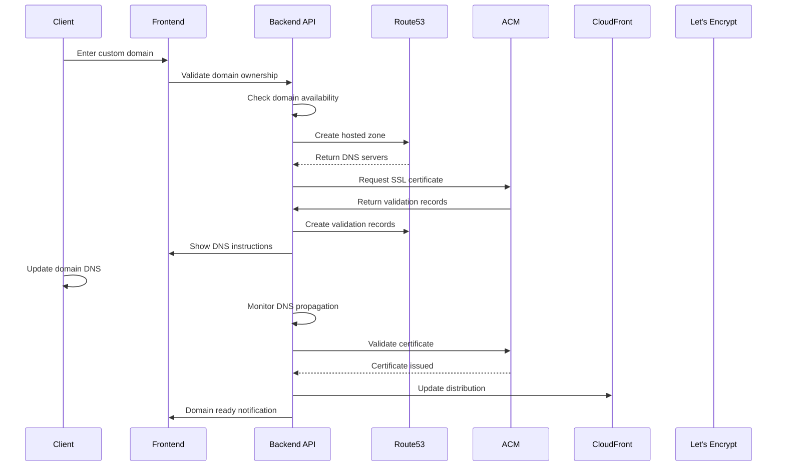

# StackPro Custom Domain & SSL Automation Architecture
## Automated Domain Management with Route 53 & ACM Integration

### 🎯 **Executive Summary**
This document outlines the comprehensive architecture for automating custom domain setup, DNS management, SSL certificate provisioning, and domain validation for StackPro clients, with fallback mechanisms and global Let's Encrypt integration.

---

## 🏗️ **Architecture Overview**

### **Core Components:**
1. **Domain Management API** - Custom domain registration and validation
2. **Route 53 Automation** - DNS record management and propagation
3. **ACM Integration** - Automated SSL certificate provisioning
4. **Domain Validation** - CNAME/TXT record verification
5. **Let's Encrypt Fallback** - Global SSL certificate alternative
6. **Monitoring System** - Domain health and certificate renewal

---

## 🌐 **Domain Management Flow**

### **1. Client Domain Onboarding Process**


### **2. Domain Setup API Implementation**
```javascript
class DomainManagementService {
  constructor() {
    this.route53 = new AWS.Route53();
    this.acm = new AWS.ACM();
    this.cloudfront = new AWS.CloudFront();
    this.dynamodb = new AWS.DynamoDB.DocumentClient();
  }

  async initiateCustomDomain(clientId, domain, subdomain = null) {
    try {
      // Validate domain format and ownership requirements
      const domainValidation = await this.validateDomainInput(domain);
      if (!domainValidation.valid) {
        throw new Error(`Domain validation failed: ${domainValidation.error}`);
      }

      const fullDomain = subdomain ? `${subdomain}.${domain}` : domain;
      
      // Check if domain is already in use
      const existingDomain = await this.checkDomainExists(fullDomain);
      if (existingDomain) {
        throw new Error('Domain is already in use by another client');
      }

      // Create domain configuration record
      const domainConfig = await this.createDomainConfig(clientId, fullDomain, domain);
      
      // Start the setup process
      const setupResult = await this.setupDomainInfrastructure(domainConfig);
      
      return {
        success: true,
        domainId: domainConfig.domainId,
        status: 'pending_dns_setup',
        dnsInstructions: setupResult.dnsInstructions,
        estimatedTime: '10-30 minutes',
        validationRecords: setupResult.validationRecords
      };

    } catch (error) {
      await this.logDomainError(clientId, domain, error);
      throw error;
    }
  }

  async setupDomainInfrastructure(domainConfig) {
    const { clientId, fullDomain, rootDomain, domainId } = domainConfig;
    
    // Step 1: Create or get hosted zone
    const hostedZone = await this.createHostedZone(rootDomain, clientId);
    
    // Step 2: Request SSL certificate
    const certificate = await this.requestSSLCertificate(fullDomain, hostedZone.hostedZoneId);
    
    // Step 3: Create DNS validation records
    const validationRecords = await this.createValidationRecords(
      certificate.certificateArn, 
      hostedZone.hostedZoneId
    );
    
    // Step 4: Update domain config with infrastructure details
    await this.updateDomainConfig(domainId, {
      hostedZoneId: hostedZone.hostedZoneId,
      nameServers: hostedZone.nameServers,
      certificateArn: certificate.certificateArn,
      status: 'pending_validation',
      infrastructureCreated: new Date().toISOString()
    });

    return {
      dnsInstructions: {
        nameServers: hostedZone.nameServers,
        message: `Update your domain's DNS settings to use these name servers`,
        records: validationRecords
      },
      validationRecords,
      hostedZoneId: hostedZone.hostedZoneId,
      certificateArn: certificate.certificateArn
    };
  }

  async createHostedZone(domain, clientId) {
    try {
      // Check if hosted zone already exists
      const existingZones = await this.route53.listHostedZonesByName({
        DNSName: domain
      }).promise();

      const existingZone = existingZones.HostedZones.find(
        zone => zone.Name === `${domain}.`
      );

      if (existingZone) {
        return {
          hostedZoneId: existingZone.Id.replace('/hostedzone/', ''),
          nameServers: await this.getNameServers(existingZone.Id)
        };
      }

      // Create new hosted zone
      const hostedZone = await this.route53.createHostedZone({
        Name: domain,
        CallerReference: `stackpro-${clientId}-${Date.now()}`,
        HostedZoneConfig: {
          Comment: `StackPro hosted zone for client ${clientId}`,
          PrivateZone: false
        }
      }).promise();

      const nameServers = hostedZone.DelegationSet.NameServers;
      const hostedZoneId = hostedZone.HostedZone.Id.replace('/hostedzone/', '');

      // Tag the hosted zone
      await this.route53.changeTagsForResource({
        ResourceType: 'hostedzone',
        ResourceId: hostedZoneId,
        AddTags: [
          { Key: 'ClientId', Value: clientId },
          { Key: 'Environment', Value: 'production' },
          { Key: 'ManagedBy', Value: 'StackPro' }
        ]
      }).promise();

      return {
        hostedZoneId,
        nameServers
      };

    } catch (error) {
      throw new Error(`Failed to create hosted zone: ${error.message}`);
    }
  }

  async requestSSLCertificate(domain, hostedZoneId) {
    try {
      // Include both root and www versions
      const domainNames = [domain];
      if (!domain.startsWith('www.')) {
        domainNames.push(`www.${domain}`);
      }

      const certificate = await this.acm.requestCertificate({
        DomainName: domain,
        SubjectAlternativeNames: domainNames.slice(1),
        ValidationMethod: 'DNS',
        Tags: [
          { Key: 'ClientId', Value: this.extractClientId(hostedZoneId) },
          { Key: 'Domain', Value: domain },
          { Key: 'ManagedBy', Value: 'StackPro' }
        ]
      }).promise();

      return {
        certificateArn: certificate.CertificateArn
      };

    } catch (error) {
      throw new Error(`Failed to request SSL certificate: ${error.message}`);
    }
  }

  async createValidationRecords(certificateArn, hostedZoneId) {
    try {
      // Get certificate details for validation
      const certificate = await this.acm.describeCertificate({
        CertificateArn: certificateArn
      }).promise();

      const validationRecords = [];
      const recordChanges = [];

      // Process each domain validation
      for (const domainValidation of certificate.Certificate.DomainValidationOptions) {
        if (domainValidation.ValidationStatus === 'PENDING_VALIDATION') {
          const record = domainValidation.ResourceRecord;
          
          validationRecords.push({
            domain: domainValidation.DomainName,
            name: record.Name,
            type: record.Type,
            value: record.Value,
            status: 'pending'
          });

          recordChanges.push({
            Action: 'CREATE',
            ResourceRecordSet: {
              Name: record.Name,
              Type: record.Type,
              TTL: 300,
              ResourceRecords: [{ Value: record.Value }]
            }
          });
        }
      }

      // Create DNS validation records
      if (recordChanges.length > 0) {
        await this.route53.changeResourceRecordSets({
          HostedZoneId: hostedZoneId,
          ChangeBatch: {
            Comment: 'SSL certificate validation records',
            Changes: recordChanges
          }
        }).promise();
      }

      return validationRecords;

    } catch (error) {
      throw new Error(`Failed to create validation records: ${error.message}`);
    }
  }

  // Domain monitoring and validation
  async monitorDomainSetup() {
    const pendingDomains = await this.getPendingDomains();
    
    for (const domain of pendingDomains) {
      try {
        await this.checkDomainProgress(domain);
      } catch (error) {
        await this.handleDomainError(domain, error);
      }
    }
  }

  async checkDomainProgress(domainConfig) {
    const { domainId, fullDomain, certificateArn, hostedZoneId, status } = domainConfig;
    
    switch (status) {
      case 'pending_validation':
        return await this.checkCertificateValidation(domainConfig);
      
      case 'certificate_issued':
        return await this.setupCloudFrontDistribution(domainConfig);
      
      case 'distribution_created':
        return await this.createAliasRecords(domainConfig);
      
      case 'dns_configured':
        return await this.verifyDomainAccess(domainConfig);
      
      default:
        return domainConfig;
    }
  }

  async checkCertificateValidation(domainConfig) {
    const certificate = await this.acm.describeCertificate({
      CertificateArn: domainConfig.certificateArn
    }).promise();

    if (certificate.Certificate.Status === 'ISSUED') {
      await this.updateDomainConfig(domainConfig.domainId, {
        status: 'certificate_issued',
        certificateIssued: new Date().toISOString()
      });
      
      // Send notification to client
      await this.notifyDomainProgress(domainConfig.clientId, {
        domain: domainConfig.fullDomain,
        status: 'SSL certificate issued',
        nextStep: 'Setting up CloudFront distribution'
      });

      return { ...domainConfig, status: 'certificate_issued' };
    }

    // Check if validation failed
    if (certificate.Certificate.Status === 'FAILED') {
      throw new Error('Certificate validation failed');
    }

    return domainConfig; // Still pending
  }

  async setupCloudFrontDistribution(domainConfig) {
    try {
      const distribution = await this.cloudfront.createDistribution({
        DistributionConfig: {
          CallerReference: `stackpro-${domainConfig.clientId}-${Date.now()}`,
          Comment: `StackPro distribution for ${domainConfig.fullDomain}`,
          Enabled: true,
          
          // Origins
          Origins: {
            Quantity: 1,
            Items: [
              {
                Id: 'stackpro-origin',
                DomainName: `${domainConfig.clientId}.stackpro.io`,
                CustomOriginConfig: {
                  HTTPPort: 80,
                  HTTPSPort: 443,
                  OriginProtocolPolicy: 'https-only'
                }
              }
            ]
          },
          
          // Default cache behavior
          DefaultCacheBehavior: {
            TargetOriginId: 'stackpro-origin',
            ViewerProtocolPolicy: 'redirect-to-https',
            MinTTL: 0,
            ForwardedValues: {
              QueryString: true,
              Cookies: { Forward: 'none' }
            }
          },
          
          // Custom domain configuration
          Aliases: {
            Quantity: 1,
            Items: [domainConfig.fullDomain]
          },
          
          // SSL certificate
          ViewerCertificate: {
            ACMCertificateArn: domainConfig.certificateArn,
            SSLSupportMethod: 'sni-only',
            MinimumProtocolVersion: 'TLSv1.2_2021'
          }
        }
      }).promise();

      await this.updateDomainConfig(domainConfig.domainId, {
        distributionId: distribution.Distribution.Id,
        distributionDomain: distribution.Distribution.DomainName,
        status: 'distribution_created'
      });

      return {
        ...domainConfig,
        distributionId: distribution.Distribution.Id,
        distributionDomain: distribution.Distribution.DomainName,
        status: 'distribution_created'
      };

    } catch (error) {
      throw new Error(`Failed to create CloudFront distribution: ${error.message}`);
    }
  }

  async createAliasRecords(domainConfig) {
    try {
      // Create A record pointing to CloudFront
      await this.route53.changeResourceRecordSets({
        HostedZoneId: domainConfig.hostedZoneId,
        ChangeBatch: {
          Comment: 'Create alias record for custom domain',
          Changes: [
            {
              Action: 'CREATE',
              ResourceRecordSet: {
                Name: domainConfig.fullDomain,
                Type: 'A',
                AliasTarget: {
                  DNSName: domainConfig.distributionDomain,
                  EvaluateTargetHealth: false,
                  HostedZoneId: 'Z2FDTNDATAQYW2' // CloudFront hosted zone ID
                }
              }
            }
          ]
        }
      }).promise();

      await this.updateDomainConfig(domainConfig.domainId, {
        status: 'dns_configured',
        aliasRecordsCreated: new Date().toISOString()
      });

      return { ...domainConfig, status: 'dns_configured' };

    } catch (error) {
      throw new Error(`Failed to create alias records: ${error.message}`);
    }
  }
}
```

---

## 🔄 **Let's Encrypt Integration**

### **1. Let's Encrypt Fallback Service**
```javascript
class LetsEncryptService {
  constructor() {
    this.acme = require('acme-client');
    this.client = null;
  }

  async initializeClient() {
    if (!this.client) {
      this.client = new this.acme.Client({
        directoryUrl: process.env.NODE_ENV === 'production' 
          ? this.acme.directory.letsencrypt.production
          : this.acme.directory.letsencrypt.staging,
        accountKey: await this.getOrCreateAccountKey()
      });

      // Register account if needed
      await this.client.createAccount({
        termsOfServiceAgreed: true,
        contact: [`mailto:admin@stackpro.io`]
      });
    }

    return this.client;
  }

  async requestLetsEncryptCertificate(domain, clientId) {
    try {
      const client = await this.initializeClient();
      
      // Create certificate order
      const order = await client.createOrder({
        identifiers: [
          { type: 'dns', value: domain },
          { type: 'dns', value: `www.${domain}` }
        ]
      });

      // Process each authorization
      const authorizations = await Promise.all(
        order.authorizations.map(url => client.getAuthorization(url))
      );

      const challenges = [];
      
      for (const auth of authorizations) {
        // Use DNS challenge for domain validation
        const dnsChallenge = auth.challenges.find(c => c.type === 'dns-01');
        
        if (dnsChallenge) {
          // Get challenge key authorization
          const keyAuthorization = await client.getChallengeKeyAuthorization(dnsChallenge);
          const txtRecord = crypto.createHash('sha256')
            .update(keyAuthorization)
            .digest('base64')
            .replace(/\+/g, '-')
            .replace(/\//g, '_')
            .replace(/=/g, '');

          challenges.push({
            domain: auth.identifier.value,
            challenge: dnsChallenge,
            txtRecord,
            recordName: `_acme-challenge.${auth.identifier.value}`
          });
        }
      }

      // Create DNS records for validation
      await this.createLetsEncryptValidationRecords(domain, challenges);

      // Wait for DNS propagation
      await this.waitForDNSPropagation(challenges);

      // Complete challenges
      for (const { challenge } of challenges) {
        await client.completeChallenge(challenge);
      }

      // Wait for order completion
      await client.waitForValidStatus(order);

      // Generate certificate
      const [key, csr] = await this.acme.crypto.createCsr({
        commonName: domain,
        altNames: [`www.${domain}`]
      });

      // Finalize order and get certificate
      await client.finalizeOrder(order, csr);
      const certificate = await client.getCertificate(order);

      // Store certificate
      await this.storeLetsEncryptCertificate(clientId, domain, {
        privateKey: key.toString(),
        certificate: certificate.toString(),
        issuedAt: new Date().toISOString(),
        expiresAt: new Date(Date.now() + 90 * 24 * 60 * 60 * 1000).toISOString() // 90 days
      });

      return {
        success: true,
        certificate: certificate.toString(),
        privateKey: key.toString(),
        provider: 'letsencrypt'
      };

    } catch (error) {
      throw new Error(`Let's Encrypt certificate request failed: ${error.message}`);
    }
  }

  async renewLetsEncryptCertificates() {
    const expiringCertificates = await this.getExpiringCertificates(30); // 30 days
    
    for (const cert of expiringCertificates) {
      try {
        await this.requestLetsEncryptCertificate(cert.domain, cert.clientId);
        await this.notifyCertificateRenewal(cert.clientId, cert.domain);
      } catch (error) {
        await this.notifyCertificateRenewalFailure(cert.clientId, cert.domain, error);
      }
    }
  }
}
```

### **2. Certificate Management & Monitoring**
```javascript
class CertificateMonitoringService {
  constructor() {
    this.cloudwatch = new AWS.CloudWatch();
    this.sns = new AWS.SNS();
  }

  async monitorCertificateHealth() {
    const allDomains = await this.getAllActiveDomains();
    
    for (const domain of allDomains) {
      const health = await this.checkCertificateHealth(domain);
      
      // Update CloudWatch metrics
      await this.updateCertificateMetrics(domain, health);
      
      // Handle unhealthy certificates
      if (!health.isHealthy) {
        await this.handleUnhealthyCertificate(domain, health);
      }
    }
  }

  async checkCertificateHealth(domain) {
    try {
      const https = require('https');
      const url = require('url');
      
      return new Promise((resolve) => {
        const options = {
          hostname: domain.fullDomain,
          port: 443,
          path: '/',
          method: 'HEAD',
          timeout: 10000
        };

        const req = https.request(options, (res) => {
          const cert = res.connection.getPeerCertificate();
          
          if (cert && cert.valid_to) {
            const expiryDate = new Date(cert.valid_to);
            const daysUntilExpiry = Math.floor((expiryDate - new Date()) / (1000 * 60 * 60 * 24));
            
            resolve({
              isHealthy: daysUntilExpiry > 7,
              daysUntilExpiry,
              issuer: cert.issuer?.CN || 'Unknown',
              validFrom: cert.valid_from,
              validTo: cert.valid_to,
              subject: cert.subject?.CN
            });
          } else {
            resolve({
              isHealthy: false,
              error: 'No certificate found'
            });
          }
        });

        req.on('error', () => {
          resolve({
            isHealthy: false,
            error: 'Connection failed'
          });
        });

        req.on('timeout', () => {
          resolve({
            isHealthy: false,
            error: 'Connection timeout'
          });
        });

        req.end();
      });

    } catch (error) {
      return {
        isHealthy: false,
        error: error.message
      };
    }
  }

  async updateCertificateMetrics(domain, health) {
    const metrics = [
      {
        MetricName: 'CertificateHealth',
        Value: health.isHealthy ? 1 : 0,
        Unit: 'Count',
        Dimensions: [
          { Name: 'Domain', Value: domain.fullDomain },
          { Name: 'ClientId', Value: domain.clientId }
        ]
      }
    ];

    if (health.daysUntilExpiry !== undefined) {
      metrics.push({
        MetricName: 'DaysUntilExpiry',
        Value: health.daysUntilExpiry,
        Unit: 'Count',
        Dimensions: [
          { Name: 'Domain', Value: domain.fullDomain },
          { Name: 'ClientId', Value: domain.clientId }
        ]
      });
    }

    await this.cloudwatch.putMetricData({
      Namespace: 'StackPro/Certificates',
      MetricData: metrics
    }).promise();
  }
}
```

---

## 🎯 **Frontend Integration**

### **1. Domain Setup UI Component**
```typescript
// React component for custom domain setup
import React, { useState, useEffect } from 'react';

interface DomainSetupProps {
  clientId: string;
  onDomainConfigured: (domain: string) => void;
}

const CustomDomainSetup: React.FC<DomainSetupProps> = ({ 
  clientId, 
  onDomainConfigured 
}) => {
  const [domain, setDomain] = useState('');
  const [subdomain, setSubdomain] = useState('');
  const [loading, setLoading] = useState(false);
  const [setupStatus, setSetupStatus] = useState<any>(null);
  const [dnsInstructions, setDnsInstructions] = useState<any>(null);

  const handleDomainSubmit = async (e: React.FormEvent) => {
    e.preventDefault();
    setLoading(true);

    try {
      const response = await fetch('/api/domains/setup', {
        method: 'POST',
        headers: {
          'Content-Type': 'application/json',
          'Authorization': `Bearer ${localStorage.getItem('token')}`
        },
        body: JSON.stringify({
          clientId,
          domain,
          subdomain: subdomain || null
        })
      });

      const result = await response.json();

      if (result.success) {
        setSetupStatus(result);
        setDnsInstructions(result.dnsInstructions);
        
        // Start monitoring setup progress
        monitorDomainSetup(result.domainId);
      } else {
        throw new Error(result.error);
      }
    } catch (error) {
      alert(`Domain setup failed: ${error.message}`);
    } finally {
      setLoading(false);
    }
  };

  const monitorDomainSetup = async (domainId: string) => {
    const checkProgress = async () => {
      try {
        const response = await fetch(`/api/domains/${domainId}/status`);
        const status = await response.json();
        
        setSetupStatus(status);
        
        if (status.status === 'active') {
          onDomainConfigured(status.fullDomain);
          return; // Stop monitoring
        }
        
        if (status.status === 'failed') {
          alert(`Domain setup failed: ${status.error}`);
          return;
        }
        
        // Continue monitoring
        setTimeout(checkProgress, 30000); // Check every 30 seconds
        
      } catch (error) {
        console.error('Failed to check domain status:', error);
      }
    };

    // Start monitoring
    setTimeout(checkProgress, 10000); // Initial delay
  };

  const copyToClipboard = (text: string) => {
    navigator.clipboard.writeText(text);
    alert('Copied to clipboard!');
  };

  return (
    <div className="custom-domain-setup">
      <div className="card">
        <h3>Custom Domain Setup</h3>
        
        {!setupStatus ? (
          <form onSubmit={handleDomainSubmit} className="domain-form">
            <div className="form-group">
              <label>Domain Name</label>
              <div className="domain-input-group">
                <input
                  type="text"
                  placeholder="subdomain (optional)"
                  value={subdomain}
                  onChange={(e) => setSubdomain(e.target.value)}
                  className="subdomain-input"
                />
                <span className="domain-separator">.</span>
                <input
                  type="text"
                  placeholder="yourdomain.com"
                  value={domain}
                  onChange={(e) => setDomain(e.target.value)}
                  required
                  className="domain-input"
                />
              </div>
            </div>
            
            <button 
              type="submit" 
              disabled={loading || !domain}
              className="btn-primary"
            >
              {loading ? 'Setting up...' : 'Setup Custom Domain'}
            </button>
          </form>
        ) : (
          <div className="setup-progress">
            <div className="status-header">
              <h4>{setupStatus.fullDomain}</h4>
              <span className={`status-badge ${setupStatus.status}`}>
                {setupStatus.status.replace('_', ' ')}
              </span>
            </div>

            {dnsInstructions && (
              <div className="dns-instructions">
                <h5>DNS Configuration Required</h5>
                <p>Update your domain's DNS settings with the following name servers:</p>
                
                <div className="name-servers">
                  {dnsInstructions.nameServers?.map((ns, index) => (
                    <div key={index} className="name-server">
                      <code>{ns}</code>
                      <button 
                        onClick={() => copyToClipboard(ns)}
                        className="copy-btn"
                      >
                        Copy
                      </button>
                    </div>
                  ))}
                </div>

                <div className="validation-records">
                  <h6>Validation Records</h6>
                  {dnsInstructions.records?.map((record, index) => (
                    <div key={index} className="validation-record">
                      <div><strong>Type:</strong> {record.type}</div>
                      <div><strong>Name:</strong> {record.name}</div>
                      <div>
                        <strong>Value:</strong> 
                        <code>{record.value}</code>
                        <button 
                          onClick={() => copyToClipboard(record.value)}
                          className="copy-btn"
                        >
                          Copy
                        </button>
                      </div>
                    </div>
                  ))}
                </div>

                <div className="progress-info">
                  <p>⏱️ Estimated setup time: {setupStatus.estimatedTime}</p>
                  <p>We'll notify you once your domain is ready!</p>
                </div>
              </div>
            )}

            {setupStatus.status === 'active' && (
              <div className="success-message">
                <h5>🎉 Domain Setup Complete!</h5>
                <p>Your custom domain is now active and secured with SSL.</p>
                <a 
                  href={`https://${setupStatus.fullDomain}`} 
                  target="_blank"
                  className="btn-primary"
                >
                  Visit Your Site
                </a>
              </div>
            )}
          </div>
        )}
      </div>

      <div className="domain-help">
        <h5>Need Help?</h5>
        <ul>
          <li>Make sure you own the domain you're trying to add</li>
          <li>DNS changes can take up to 48 hours to fully propagate</li>
          <li>Contact support if you encounter any issues</li>
        </ul>
      </div>
    </div>
  );
};

export default CustomDomainSetup;
```

### **2. Domain Management Dashboard**
```typescript
const DomainManagement: React.FC<{ clientId: string }> = ({ clientId }) => {
  const [domains, setDomains] = useState([]);
  const [loading, setLoading] = useState(true);

  useEffect(() => {
    loadDomains();
  }, [clientId]);

  const loadDomains = async () => {
    try {
      const response = await fetch(`/api/domains/client/${clientId}`);
      const result = await response.json();
      setDomains(result.domains || []);
    } catch (error) {
      console.error('Failed to load domains:', error);
    } finally {
      setLoading(false);
    }
  };

  const deleteDomain = async (domainId: string) => {
    if (!confirm('Are you sure you want to delete this domain?')) {
      return;
    }

    try {
      const response = await fetch(`/api/domains
