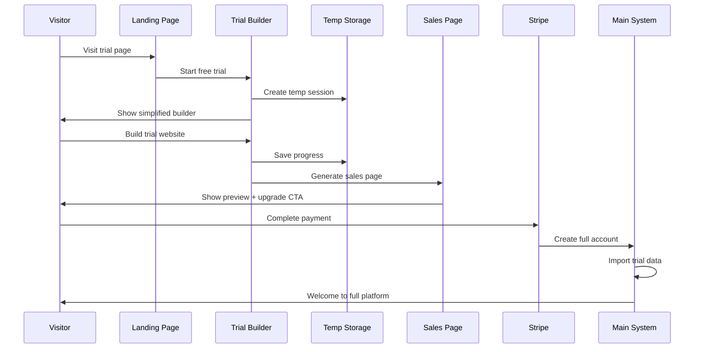

# StackPro Pre-Onboarding Trial System Architecture
## Public-Facing Trial Builder with Conversion Optimization

### 🎯 **Executive Summary**
This document outlines the comprehensive architecture for a public-facing trial system that allows potential customers to build their business website for free, auto-generates sales pages, stores progress in temporary containers, and converts trials to paid subscriptions seamlessly.

---

## 🏗️ **Architecture Overview**

### **Core Components:**
1. **Trial Builder Engine** - Simplified website creation tool
2. **Temporary Storage System** - Ephemeral trial data management
3. **Sales Page Generator** - Automated conversion-focused pages
4. **Progress Persistence** - Session and cross-device continuity
5. **Conversion Tracking** - Analytics and optimization
6. **Upgrade Flow** - Seamless trial-to-paid conversion

---

## 🎨 **Trial Builder Flow**

### **1. Public Trial Journey**


### **2. Trial Builder Implementation**
```javascript
class TrialBuilderService {
  constructor() {
    this.redis = new Redis(process.env.REDIS_URL);
    this.s3 = new AWS.S3();
    this.dynamodb = new AWS.DynamoDB.DocumentClient();
  }

  async initializeTrialSession(visitorData) {
    const trialId = `trial-${Date.now()}-${Math.random().toString(36).substr(2, 9)}`;
    
    // Create trial session
    const trialSession = {
      trialId,
      visitorId: visitorData.visitorId || this.generateVisitorId(),
      industry: visitorData.industry,
      businessName: visitorData.businessName || '',
      startedAt: new Date().toISOString(),
      expiresAt: new Date(Date.now() + (24 * 60 * 60 * 1000)).toISOString(), // 24 hours
      status: 'active',
      
      // Trial limitations
      features: {
        templates: ['basic-business', 'simple-service'],
        maxPages: 3,
        maxImages: 10,
        customizations: ['colors', 'fonts', 'basic-layout']
      },
      
      // Tracking data
      analytics: {
        timeSpent: 0,
        interactions: 0,
        conversionEvents: []
      },
      
      // Progress storage
      website: {
        template: null,
        pages: {},
        assets: [],
        customizations: {}
      }
    };

    // Store in Redis for fast access
    await this.redis.setex(
      `trial:${trialId}`, 
      86400, // 24 hours TTL
      JSON.stringify(trialSession)
    );

    // Store in DynamoDB for persistence
    await this.dynamodb.put({
      TableName: 'StackPro-TrialSessions',
      Item: {
        ...trialSession,
        ttl: Math.floor(Date.now() / 1000) + 86400 // DynamoDB TTL
      }
    }).promise();

    return {
      trialId,
      session: trialSession,
      builderUrl: `/trial/${trialId}/builder`,
      expiresIn: '24 hours'
    };
  }

  async getTrialBuilderConfig(trialId) {
    const session = await this.getTrialSession(trialId);
    
    if (!session || session.status !== 'active') {
      throw new Error('Trial session not found or expired');
    }

    // Return simplified builder configuration
    return {
      trialId: session.trialId,
      businessName: session.businessName,
      industry: session.industry,
      
      // Limited template options for trials
      availableTemplates: [
        {
          id: 'basic-business',
          name: 'Basic Business',
          preview: '/images/templates/basic-business-preview.jpg',
          category: 'general',
          trialOptimized: true
        },
        {
          id: 'simple-service',
          name: 'Service Provider',
          preview: '/images/templates/simple-service-preview.jpg',
          category: 'services',
          trialOptimized: true
        }
      ],
      
      // Simplified customization options
      customizationOptions: {
        colors: {
          primary: ['#007bff', '#28a745', '#dc3545', '#ffc107', '#6f42c1'],
          secondary: ['#6c757d', '#343a40', '#f8f9fa']
        },
        fonts: {
          heading: ['Arial', 'Georgia', 'Helvetica'],
          body: ['Arial', 'Georgia', 'Times New Roman']
        },
        layouts: ['single-column', 'sidebar-left', 'sidebar-right']
      },
      
      // Trial limitations displayed
      limitations: {
        maxPages: session.features.maxPages,
        maxImages: session.features.maxImages,
        upgradeRequired: [
          'Custom domains',
          'Advanced templates',
          'E-commerce features',
          'SEO tools',
          'Analytics integration'
        ]
      },
      
      // Current progress
      progress: session.website,
      timeRemaining: this.calculateTimeRemaining(session.expiresAt)
    };
  }

  async updateTrialProgress(trialId, updates) {
    const session = await this.getTrialSession(trialId);
    
    if (!session || session.status !== 'active') {
      throw new Error('Trial session not found or expired');
    }

    // Track interaction for analytics
    session.analytics.interactions++;
    session.analytics.timeSpent += updates.timeSpent || 0;

    // Apply updates with validation
    const validatedUpdates = this.validateTrialUpdates(updates, session.features);
    
    // Merge updates into session
    session.website = {
      ...session.website,
      ...validatedUpdates
    };

    session.lastUpdated = new Date().toISOString();

    // Save to both Redis and DynamoDB
    await Promise.all([
      this.redis.setex(`trial:${trialId}`, 86400, JSON.stringify(session)),
      this.updateTrialInDynamoDB(session)
    ]);

    // Check for conversion triggers
    await this.checkConversionTriggers(session);

    return {
      success: true,
      session: session,
      salesPageReady: this.shouldGenerateSalesPage(session)
    };
  }

  validateTrialUpdates(updates, features) {
    const validated = { ...updates };

    // Enforce page limit
    if (validated.pages && Object.keys(validated.pages).length > features.maxPages) {
      throw new Error(`Trial limited to ${features.maxPages} pages`);
    }

    // Enforce asset limit
    if (validated.assets && validated.assets.length > features.maxImages) {
      throw new Error(`Trial limited to ${features.maxImages} images`);
    }

    // Only allow permitted customizations
    if (validated.customizations) {
      const allowedKeys = features.customizations;
      validated.customizations = Object.keys(validated.customizations)
        .filter(key => allowedKeys.includes(key))
        .reduce((obj, key) => {
          obj[key] = validated.customizations[key];
          return obj;
        }, {});
    }

    return validated;
  }

  shouldGenerateSalesPage(session) {
    // Generate sales page when user has made meaningful progress
    const hasContent = Object.keys(session.website.pages).length > 0;
    const hasCustomizations = Object.keys(session.website.customizations).length > 0;
    const timeSpent = session.analytics.timeSpent > 300; // 5 minutes
    
    return hasContent && (hasCustomizations || timeSpent);
  }

  async checkConversionTriggers(session) {
    const triggers = [];

    // Time-based triggers
    const timeSpent = session.analytics.timeSpent;
    if (timeSpent > 600 && !session.analytics.conversionEvents.includes('10min_spent')) {
      triggers.push('10min_spent');
    }

    // Interaction-based triggers
    if (session.analytics.interactions > 20 && !session.analytics.conversionEvents.includes('high_engagement')) {
      triggers.push('high_engagement');
    }

    // Progress-based triggers
    if (Object.keys(session.website.pages).length >= 2 && !session.analytics.conversionEvents.includes('multi_page')) {
      triggers.push('multi_page');
    }

    // Fire triggers
    for (const trigger of triggers) {
      await this.fireConversionTrigger(session.trialId, trigger);
      session.analytics.conversionEvents.push(trigger);
    }
  }

  async fireConversionTrigger(trialId, trigger) {
    // Log conversion event
    await this.logConversionEvent(trialId, trigger);

    // Trigger appropriate response based on event
    switch (trigger) {
      case '10min_spent':
        await this.showUpgradePrompt(trialId, 'time_investment');
        break;
      case 'high_engagement':
        await this.generatePersonalizedOffer(trialId);
        break;
      case 'multi_page':
        await this.showAdvancedFeaturesTeaser(trialId);
        break;
    }
  }
}
```

---

## 📄 **Auto-Generated Sales Page System**

### **1. Dynamic Sales Page Generator**
```javascript
class SalesPageGenerator {
  constructor() {
    this.templateEngine = new TemplateEngine();
    this.analyticsTracker = new AnalyticsTracker();
  }

  async generateSalesPage(trialSession) {
    try {
      // Analyze trial progress for personalization
      const analysis = await this.analyzeTrialProgress(trialSession);
      
      // Generate personalized content
      const content = await this.generatePersonalizedContent(analysis);
      
      // Create the sales page
      const salesPage = await this.buildSalesPage(content, trialSession);
      
      // Store for serving
      await this.storeSalesPage(trialSession.trialId, salesPage);
      
      return {
        success: true,
        salesPageUrl: `/trial/${trialSession.trialId}/upgrade`,
        personalization: analysis,
        conversionOptimizations: content.optimizations
      };

    } catch (error) {
      throw new Error(`Sales page generation failed: ${error.message}`);
    }
  }

  async analyzeTrialProgress(session) {
    const analysis = {
      businessType: this.inferBusinessType(session),
      engagementLevel: this.calculateEngagementLevel(session),
      preferredFeatures: this.identifyPreferredFeatures(session),
      conversionReadiness: this.assessConversionReadiness(session),
      timeInvestment: session.analytics.timeSpent,
      progressMade: this.calculateProgress(session.website)
    };

    // Industry-specific insights
    if (session.industry) {
      analysis.industryInsights = await this.getIndustryInsights(session.industry);
    }

    return analysis;
  }

  async generatePersonalizedContent(analysis) {
    const baseTemplate = await this.getBaseSalesTemplate();
    
    return {
      headline: this.generatePersonalizedHeadline(analysis),
      subheadline: this.generateSubheadline(analysis),
      businessSpecificBenefits: await this.generateBusinessBenefits(analysis),
      socialProof: await this.getRelevantTestimonials(analysis.businessType),
      pricingPresentation: this.optimizePricingPresentation(analysis),
      urgencyElements: this.createUrgencyElements(analysis),
      guarantees: this.selectRelevantGuarantees(analysis),
      
      // Conversion optimizations based on trial behavior
      optimizations: {
        cta_text: this.optimizeCTAText(analysis),
        layout: this.selectOptimalLayout(analysis),
        colorScheme: this.matchTrialPreferences(analysis),
        testimonialPlacement: this.optimizeTestimonialPlacement(analysis)
      }
    };
  }

  generatePersonalizedHeadline(analysis) {
    const templates = {
      high_engagement: "You're Just Minutes Away from Your Professional {businessType} Website",
      medium_engagement: "Turn Your Vision Into a Professional {businessType} Website",
      low_engagement: "Complete Your {businessType} Website in Under 10 Minutes",
      time_invested: "Don't Lose the Progress You've Made - Publish Your Website Now",
      feature_focused: "Unlock Advanced {preferredFeature} Features for Your Business"
    };

    let template = templates.medium_engagement; // default

    if (analysis.timeInvestment > 600) {
      template = templates.time_invested;
    } else if (analysis.engagementLevel === 'high') {
      template = templates.high_engagement;
    } else if (analysis.preferredFeatures.length > 0) {
      template = templates.feature_focused;
    }

    return template
      .replace('{businessType}', analysis.businessType || 'Business')
      .replace('{preferredFeature}', analysis.preferredFeatures[0] || 'Design');
  }

  async buildSalesPage(content, session) {
    const pageData = {
      trialId: session.trialId,
      businessName: session.businessName,
      industry: session.industry,
      
      // Header section
      header: {
        headline: content.headline,
        subheadline: content.subheadline,
        preview: await this.generateWebsitePreview(session.website),
        cta: {
          primary: content.optimizations.cta_text,
          secondary: "Continue editing for free"
        }
      },

      // Benefits section
      benefits: {
        title: "Everything You Need to Succeed Online",
        items: content.businessSpecificBenefits,
        comparison: await this.generateComparisonTable()
      },

      // Social proof
      socialProof: {
        testimonials: content.socialProof,
        stats: await this.getRelevantStats(),
        logos: await this.getClientLogos(session.industry)
      },

      // Pricing section
      pricing: {
        ...content.pricingPresentation,
        trial_discount: this.calculateTrialDiscount(session),
        guarantee: content.guarantees
      },

      // Urgency/scarcity elements
      urgency: content.urgencyElements,

      // FAQ section
      faq: await this.generateRelevantFAQ(session.industry),

      // Footer CTA
      footerCta: {
        headline: "Ready to Take Your Business Online?",
        cta: content.optimizations.cta_text,
        backup: "Or continue building for free (expires in " + this.calculateTimeRemaining(session.expiresAt) + ")"
      }
    };

    // Render the page using template engine
    return await this.templateEngine.render('trial-sales-page', pageData);
  }

  async generateWebsitePreview(website) {
    // Create a visual preview of the trial website
    const previewData = {
      template: website.template,
      colors: website.customizations.colors,
      content: website.pages,
      layout: website.customizations.layout
    };

    // Generate screenshot or HTML preview
    return await this.createWebsitePreview(previewData);
  }

  calculateTrialDiscount(session) {
    let discount = 0;

    // Time-based discount
    const hoursSpent = session.analytics.timeSpent / 3600;
    if (hoursSpent > 2) discount += 20; // 20% for 2+ hours
    else if (hoursSpent > 1) discount += 10; // 10% for 1+ hours

    // Progress-based discount
    const progress = this.calculateProgress(session.website);
    if (progress > 75) discount += 15; // 15% for 75%+ completion
    else if (progress > 50) discount += 10; // 10% for 50%+ completion

    // Industry-based promotions
    if (session.industry === 'non_profit') discount += 25;

    return Math.min(discount, 50); // Max 50% discount
  }
}
```

### **2. Conversion Optimization Engine**
```javascript
class ConversionOptimizer {
  constructor() {
    this.testVariants = this.loadTestVariants();
    this.analytics = new AnalyticsService();
  }

  async optimizeSalesPage(trialSession, baseContent) {
    // Get visitor's test bucket
    const bucket = this.getTestBucket(trialSession.visitorId);
    
    // Apply A/B test variants
    const optimizedContent = await this.applyTestVariants(baseContent, bucket);
    
    // Personalize based on behavior
    const personalizedContent = await this.personalizeForUser(optimizedContent, trialSession);
    
    // Track test assignment
    await this.trackTestAssignment(trialSession.trialId, bucket);
    
    return personalizedContent;
  }

  loadTestVariants() {
    return {
      headline_test: {
        variants: [
          "Complete Your Professional Website in Minutes",
          "Your Business Deserves a Professional Website",
          "Turn Visitors Into Customers With a Real Website"
        ],
        weights: [0.4, 0.3, 0.3]
      },
      
      pricing_test: {
        variants: [
          { display: 'monthly_first', emphasis: 'monthly' },
          { display: 'annual_first', emphasis: 'savings' },
          { display: 'feature_value', emphasis: 'features' }
        ],
        weights: [0.33, 0.33, 0.34]
      },
      
      cta_test: {
        variants: [
          "Publish My Website Now",
          "Start My Business Website", 
          "Get My Website Live Today"
        ],
        weights: [0.4, 0.3, 0.3]
      },
      
      urgency_test: {
        variants: [
          { type: 'time_limit', message: "Trial expires in {time}" },
          { type: 'limited_discount', message: "Special trial pricing expires soon" },
          { type: 'social_proof', message: "Join 10,000+ businesses online" }
        ],
        weights: [0.4, 0.3, 0.3]
      }
    };
  }

  getTestBucket(visitorId) {
    // Consistent bucketing based on visitor ID
    const hash = this.hashVisitorId(visitorId);
    return {
      headline: this.selectVariant('headline_test', hash),
      pricing: this.selectVariant('pricing_test', hash >> 8),
      cta: this.selectVariant('cta_test', hash >> 16),
      urgency: this.selectVariant('urgency_test', hash >> 24)
    };
  }

  async personalizeForUser(content, session) {
    const personalization = {};

    // Industry-specific customizations
    if (session.industry) {
      personalization.industry_focus = await this.getIndustryPersonalization(session.industry);
    }

    // Behavior-based customizations
    if (session.analytics.timeSpent > 1800) { // 30 minutes
      personalization.investment_acknowledgment = "We can see you're serious about building your online presence";
    }

    // Progress-based customizations
    const progress = this.calculateProgress(session.website);
    if (progress > 60) {
      personalization.progress_motivation = `You're ${progress}% complete - finish your website now!`;
    }

    return {
      ...content,
      personalizations: personalization
    };
  }

  async trackConversion(trialId, conversionType, revenue = null) {
    const conversionData = {
      trialId,
      conversionType, // 'trial_to_paid', 'email_signup', 'demo_request'
      timestamp: new Date().toISOString(),
      revenue,
      source: 'trial_builder'
    };

    // Store conversion event
    await this.analytics.trackEvent('conversion', conversionData);

    // Update conversion metrics
    await this.updateConversionMetrics(conversionType);

    // Trigger post-conversion workflows
    await this.triggerPostConversionWorkflow(trialId, conversionType);
  }
}
```

---

## 💾 **Temporary Storage Management**

### **1. Trial Data Lifecycle**
```javascript
class TrialStorageManager {
  constructor() {
    this.redis = new Redis(process.env.REDIS_URL);
    this.s3 = new AWS.S3();
    this.dynamodb = new AWS.DynamoDB.DocumentClient();
  }

  async storeTrialAsset(trialId, file, metadata) {
    try {
      // Validate trial limits
      await this.validateAssetLimits(trialId, file);
      
      // Generate temporary asset key
      const assetKey = `trial-assets/${trialId}/${Date.now()}-${file.originalname}`;
      
      // Upload to S3 with TTL metadata
      await this.s3.upload({
        Bucket: process.env.TRIAL_ASSETS_BUCKET,
        Key: assetKey,
        Body: file.buffer,
        ContentType: file.mimetype,
        Metadata: {
          trialId,
          uploadedAt: new Date().toISOString(),
          expiresAt: new Date(Date.now() + 86400000).toISOString() // 24 hours
        },
        TagSet: [
          { Key: 'Type', Value: 'TrialAsset' },
          { Key: 'TrialId', Value: trialId },
          { Key: 'AutoDelete', Value: 'true' }
        ]
      }).promise();

      // Update trial session with asset reference
      await this.addAssetToTrial(trialId, {
        key: assetKey,
        originalName: file.originalname,
        size: file.size,
        url: this.generateTrialAssetUrl(assetKey),
        uploadedAt: new Date().toISOString()
      });

      return {
        success: true,
        assetKey,
        url: this.generateTrialAssetUrl(assetKey)
      };

    } catch (error) {
      throw new Error(`Trial asset storage failed: ${error.message}`);
    }
  }

  async cleanupExpiredTrials() {
    try {
      // Get expired trials from DynamoDB
      const expiredTrials = await this.getExpiredTrials();
      
      for (const trial of expiredTrials) {
        await this.cleanupTrialData(trial.trialId);
      }

      console.log(`Cleaned up ${expiredTrials.length} expired trials`);

    } catch (error) {
      console.error('Trial cleanup failed:', error);
    }
  }

  async cleanupTrialData(trialId) {
    try {
      // Delete trial assets from S3
      const assets = await this.getTrialAssets(trialId);
      if (assets.length > 0) {
        await this.s3.deleteObjects({
          Bucket: process.env.TRIAL_ASSETS_BUCKET,
          Delete: {
            Objects: assets.map(asset => ({ Key: asset.key }))
          }
        }).promise();
      }

      // Delete trial session from Redis
      await this.redis.del(`trial:${trialId}`);

      // Mark trial as expired in DynamoDB (keep for analytics)
      await this.dynamodb.update({
        TableName: 'StackPro-TrialSessions',
        Key: { trialId },
        UpdateExpression: 'SET #status = :status, cleanedUpAt = :cleanupTime',
        ExpressionAttributeNames: {
          '#status': 'status'
        },
        ExpressionAttributeValues: {
          ':status': 'expired',
          ':cleanupTime': new Date().toISOString()
        }
      }).promise();

      console.log(`Trial ${trialId} cleaned up successfully`);

    } catch (error) {
      console.error(`Failed to cleanup trial ${trialId}:`, error);
    }
  }

  // Schedule automatic cleanup
  startCleanupScheduler() {
    // Run cleanup every hour
    setInterval(async () => {
      await this.cleanupExpiredTrials();
    }, 3600000);

    // Also set up Lambda scheduled cleanup for redundancy
    this.scheduleS3LifecycleRules();
  }

  scheduleS3LifecycleRules() {
    const lifecycleConfig = {
      Bucket: process.env.TRIAL_ASSETS_BUCKET,
      LifecycleConfiguration: {
        Rules: [
          {
            ID: 'TrialAssetCleanup',
            Status: 'Enabled',
            Filter: {
              Tag: {
                Key: 'Type',
                Value: 'TrialAsset'
              }
            },
            Expiration: {
              Days: 2 // Delete after 2 days
            }
          }
        ]
      }
    };

    return this.s3.putBucketLifecycleConfiguration(lifecycleConfig).promise();
  }
}
```

### **2. Trial-to-Production Migration**
```javascript
class TrialMigrationService {
  constructor() {
    this.clientProvisioner = new ClientProvisioningService();
    this.assetMigrator = new AssetMigrationService();
  }

  async convertTrialToProduction(trialId, paymentDetails, planId) {
    try {
      // Get trial data
      const trialSession = await this.getTrialSession(trialId);
      if (!trialSession) {
        throw new Error('Trial session not found');
      }

      // Process payment first
      const payment = await this.processTrialConversion(paymentDetails, planId);
      
      // Create production client account
      const client = await this.createProductionClient(trialSession, payment);
      
      // Migrate trial data to production
      const migrationResult = await this.migrateTrialData(trialSession, client.clientId);
      
      // Set up production infrastructure
      await this.provisionClientInfrastructure(client.clientId, planId);
      
      // Send welcome email with credentials
      await this.sendWelcomeEmail(client);
      
      // Mark trial as converted
      await this.markTrialAsConverted(trialId, client.clientId);
      
      return {
        success: true,
        clientId: client.clientId,
        loginUrl: `https://${client.subdomain}.stackpro.io/login`,
        migrationSummary: migrationResult,
        welcomeEmailSent: true
      };

    } catch (error) {
      throw new Error(`Trial conversion failed: ${error.message}`);
    }
  }

  async createProductionClient(trialSession, payment) {
    // Generate client details from trial
    const clientData = {
      businessName: trialSession.businessName,
      industry: trialSession.industry,
      email: payment.email,
      phone: payment.phone || null,
      
      // Generate subdomain from business name
      subdomain: this.generateSubdomain(trialSession.businessName),
      
      // Plan information
      planId: payment.planId,
      stripeCustomerId: payment.customerId,
      stripeSubscriptionId: payment.subscriptionId,
      
      // Trial context
      convertedFromTrial: true,
      trialId: trialSession.trialId,
      trialDuration: this.calculateTrialDuration(trialSession),
      
      // Account setup
      status: 'provisioning',
      createdAt: new Date().toISOString()
    };

    // Create client record
    const client = await this.clientProvisioner.createClient(clientData);
    
    return client;
  }

  async migrateTrialData(trialSession, clientId) {
    const migrationResults = {
      website: null,
      assets: [],
      settings: null
    };

    try {
      // Migrate website structure
      if (trialSession.website && Object.keys(trialSession.website.pages).length > 0) {
        migrationResults.website = await this.migrateWebsiteStructure(
          trialSession.website, 
          clientId
        );
      }

      // Migrate assets
      if (trialSession.website.assets && trialSession.website.assets.length > 0) {
        migrationResults.assets = await this.migrateTrialAssets(
          trialSession.website.assets, 
          clientId
        );
      }

      // Migrate customizations and settings
      if (trialSession.website.customizations) {
        migrationResults.settings = await this.migrateCustomizations(
          trialSession.website.customizations, 
          clientId
        );
      }

      return migrationResults;

    } catch (error) {
      console.error('Data migration failed:', error);
      throw new Error('Failed to migrate trial data to production');
    }
  }

  async migrateTrialAssets(trialAssets, clientId) {
    const migratedAssets = [];

    for (const asset of trialAssets) {
      try {
        // Copy asset from trial bucket to production bucket
        const newAssetKey = `client-${clientId}/assets/${Date.now()}-${path.basename(asset.key)}`;
        
        await this.s3.copyObject({
          CopySource: `${process.env.TRIAL_ASSETS_BUCKET}/${asset.key}`,
          Bucket: process.env.PRODUCTION_ASSETS_BUCKET,
          Key: newAssetKey,
          TagSet: [
            { Key: 'ClientId', Value: clientId },
            { Key: 'MigratedFromTrial', Value: 'true' },
            { Key: 'Environment', Value: 'production' }
          ]
        }).promise();

        // Update asset reference
        const migr
