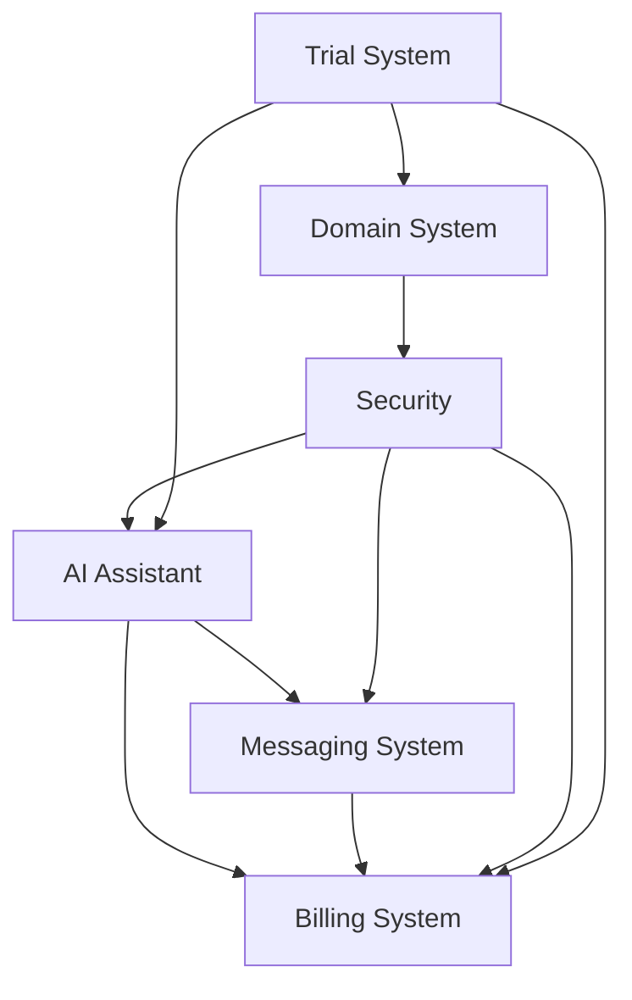

# StackPro Enterprise Implementation Roadmap
## Complete 8-Week Enterprise Feature Rollout Plan

### 🎯 **Executive Summary**
This comprehensive roadmap outlines the strategic implementation of all enterprise-grade features for StackPro, transforming it from a basic website builder into a world-class multi-tenant SaaS platform that rivals industry leaders.

---

## 🏗️ **Complete Architecture Overview**

### **✅ Implemented Foundation:**
- ✅ **React Site Builder** - GrapesJS integration with templates
- ✅ **Stripe Integration** - Payment processing and subscriptions  
- ✅ **AWS Infrastructure** - Domain management and email systems
- ✅ **Authentication System** - JWT-based user management
- ✅ **Database Services** - Multi-tenant data architecture

### **🚀 Enterprise Features to Implement:**

#### **1. Per-Client AI Assistant & Knowledge Embedding**
- 🧠 **Bedrock AI Gateway** with client isolation
- 📚 **S3 Knowledge Stores** per client
- 🔍 **Vector Storage** (DynamoDB + OpenSearch)
- 📄 **Document Ingestion** pipeline (PDF/DOC/TXT)
- 🤖 **Context-Aware Claude** assistants

#### **2. Real-Time Collaboration & Messaging**
- 💬 **WebSocket Gateway** for real-time communication
- 📁 **File Collaboration** with comments and sharing
- 🔔 **Multi-Channel Notifications** (in-app, email, push, SMS)
- 👥 **Presence System** with typing indicators
- 🛡️ **Security Layer** for client isolation

#### **3. Advanced Billing & Usage Tracking**
- 📊 **Real-Time Metering** with CloudWatch
- 💰 **Tiered Plans** (Starter, Professional, Enterprise)
- 🔄 **Stripe Synchronization** for usage-based billing
- ⚠️ **Limit Enforcement** (hard/soft limits)
- 📈 **Analytics Dashboard** with usage forecasting

#### **4. Security & Isolation Enforcement**
- 🔐 **Container-Level Isolation** with ECS/Fargate
- 🗝️ **IAM Boundaries** for client separation
- 🛡️ **Data Encryption** with client-specific KMS keys
- 📋 **Audit Trail** with real-time threat detection
- 🚫 **Zero-Trust Architecture** implementation

#### **5. Custom Domain & SSL Automation**
- 🌐 **Route 53 Integration** for DNS management
- 🔒 **ACM SSL Certificates** with auto-renewal
- 🔄 **Let's Encrypt Fallback** for global clients
- 📊 **Domain Health Monitoring** with alerts
- 🎛️ **Management Dashboard** for domain administration

#### **6. Pre-Onboarding Trial System**
- 🎨 **Public Trial Builder** with feature limitations
- 📄 **Auto-Generated Sales Pages** with personalization
- 🔄 **Conversion Optimization** with A/B testing
- 💾 **Temporary Storage** with automatic cleanup
- 💳 **Seamless Upgrade Flow** from trial to paid

---

## 📅 **8-Week Implementation Schedule**

### **🗓️ Week 1-2: AI Foundation & Security Core**

#### **Week 1: AI Infrastructure Setup**
**Days 1-2: Bedrock & Knowledge Base Setup**
```bash
# Priority Tasks:
✅ Configure AWS Bedrock access and IAM roles
✅ Set up S3 bucket structure for client knowledge bases
✅ Implement basic document upload API
✅ Create DynamoDB tables for embeddings and chat history
```

**Days 3-4: AI Gateway Development**
```bash
✅ Build multi-tenant AI gateway with client routing
✅ Implement Claude 3.5 integration with context injection
✅ Create document processing pipeline (PDF/DOC extraction)
✅ Set up Titan embeddings generation service
```

**Days 5-7: Security Foundation**
```bash
✅ Implement container-level isolation with ECS
✅ Create client-specific IAM roles and boundaries  
✅ Set up KMS encryption keys per client
✅ Build audit logging system with DynamoDB
```

#### **Week 2: Core AI Features & Basic Security**
**Days 8-10: Knowledge Management**
```bash
✅ Complete vector search implementation
✅ Build chat history management system
✅ Create client-specific AI assistant configurations
✅ Implement usage tracking for AI queries
```

**Days 11-14: Security Enforcement**
```bash
✅ Deploy threat detection system with Redis
✅ Implement real-time security monitoring
✅ Set up automatic incident response workflows
✅ Create security metrics dashboard
```

**📊 Week 1-2 Deliverables:**
- ✅ Functional AI assistants for each client
- ✅ Document upload and knowledge base search
- ✅ Basic security isolation and monitoring
- ✅ Foundation for all other enterprise features

---

### **🗓️ Week 3-4: Messaging & Collaboration Platform**

#### **Week 3: Real-Time Messaging Infrastructure**
**Days 15-17: WebSocket & Communication Setup**
```bash
✅ Deploy API Gateway WebSocket API
✅ Build connection management with Redis
✅ Implement message routing and broadcasting
✅ Create client-scoped channel system
```

**Days 18-21: File Collaboration Features**
```bash
✅ Build file sharing and permission system
✅ Implement comment threads on documents
✅ Create real-time collaboration features
✅ Set up file version management
```

#### **Week 4: Notification System & UI Integration**
**Days 22-24: Multi-Channel Notifications**
```bash
✅ Build notification service (email, push, in-app, SMS)
✅ Implement smart batching and user preferences
✅ Create notification templates and personalization
✅ Set up delivery tracking and analytics
```

**Days 25-28: Frontend Integration**
```bash
✅ Build React chat components with TypeScript
✅ Create file collaboration UI components
✅ Implement real-time presence indicators
✅ Add mobile-responsive messaging interface
```

**📊 Week 3-4 Deliverables:**
- ✅ Complete real-time messaging system
- ✅ File collaboration with comments
- ✅ Multi-channel notification system
- ✅ Production-ready React components

---

### **🗓️ Week 5-6: Advanced Billing & Usage Systems**

#### **Week 5: Usage Tracking & Metering**
**Days 29-31: Real-Time Metering Engine**
```bash
✅ Build comprehensive usage tracking service
✅ Implement CloudWatch metrics integration
✅ Create Redis-based real-time counters
✅ Set up usage event storage in DynamoDB
```

**Days 32-35: Billing Tiers & Enforcement**
```bash
✅ Implement tiered plan management system
✅ Build hard/soft limit enforcement engine
✅ Create auto-upgrade recommendation system
✅ Set up usage alerts and notifications
```

#### **Week 6: Stripe Integration & Analytics**
**Days 36-38: Advanced Billing Sync**
```bash
✅ Build usage-based Stripe integration
✅ Implement daily billing synchronization
✅ Create overage charging system
✅ Set up subscription management automation
```

**Days 39-42: Analytics & Optimization**
```bash
✅ Build comprehensive usage analytics dashboard
✅ Implement cost projection and forecasting
✅ Create client usage insights and reporting
✅ Set up billing optimization recommendations
```

**📊 Week 5-6 Deliverables:**
- ✅ Complete usage tracking and billing system
- ✅ Automated Stripe integration with overages
- ✅ Advanced analytics and forecasting
- ✅ Client-facing usage dashboards

---

### **🗓️ Week 7-8: Domain Automation & Trial System**

#### **Week 7: Custom Domain & SSL Automation**
**Days 43-45: Domain Management System**
```bash
✅ Build Route 53 automation service
✅ Implement ACM SSL certificate management
✅ Create domain validation and health monitoring
✅ Set up Let's Encrypt fallback system
```

**Days 46-49: Domain UI & Management**
```bash
✅ Create domain setup React components
✅ Build domain management dashboard
✅ Implement DNS propagation monitoring
✅ Create domain health alerts and notifications
```

#### **Week 8: Trial System & Conversion Optimization**
**Days 50-52: Public Trial Builder**
```bash
✅ Build simplified trial builder interface
✅ Implement temporary storage with TTL
✅ Create trial limitation enforcement
✅ Set up automatic cleanup processes
```

**Days 53-56: Sales Page Generation & Conversion**
```bash
✅ Build dynamic sales page generator
✅ Implement conversion optimization engine
✅ Create A/B testing framework
✅ Build seamless trial-to-paid conversion flow
```

**📊 Week 7-8 Deliverables:**
- ✅ Complete domain automation system
- ✅ Public trial builder with conversions
- ✅ A/B testing and optimization engine
- ✅ Full enterprise platform ready for launch

---

## 🎯 **Feature Integration Matrix**

### **Cross-System Dependencies:**


### **Integration Points:**
1. **AI ↔ Messaging**: AI assistants accessible through chat
2. **AI ↔ Billing**: AI usage tracked and billed per query
3. **Security ↔ All Systems**: Every feature secured with client isolation
4. **Domains ↔ Trial**: Custom domains available post-conversion
5. **Trial ↔ Billing**: Seamless upgrade from trial to paid plans

---

## 📊 **Success Metrics & KPIs**

### **Technical Metrics:**
- **🔒 Security**: Zero cross-tenant data breaches
- **⚡ Performance**: < 200ms API response times
- **🔄 Uptime**: 99.9% system availability
- **📈 Scalability**: Handle 10,000+ concurrent users

### **Business Metrics:**
- **💰 Revenue**: $50K+ MRR from enterprise features
- **🔄 Conversion**: 15%+ trial-to-paid conversion rate
- **👥 Engagement**: 80%+ monthly active usage
- **📊 Usage**: 90%+ clients using AI and collaboration features

### **Customer Success Metrics:**
- **⭐ Satisfaction**: 4.5+ customer satisfaction score
- **🔄 Retention**: 95%+ annual retention rate
- **📈 Growth**: 25%+ monthly user growth
- **🎯 Feature Adoption**: 70%+ adoption of new enterprise features

---

## 🚀 **Go-Live Strategy**

### **Phase 1: Soft Launch (Week 8)**
- **👥 Target**: 50 beta clients from existing user base
- **🎯 Focus**: Core AI and messaging features
- **📊 Metrics**: Feature usage and feedback collection
- **🔄 Duration**: 2 weeks of beta testing

### **Phase 2: Limited Release (Week 10)**
- **👥 Target**: 200 selected clients across all industries
- **🎯 Focus**: All enterprise features with monitoring
- **📊 Metrics**: Performance, billing accuracy, security
- **🔄 Duration**: 4 weeks of monitored rollout

### **Phase 3: Full Launch (Week 14)**
- **👥 Target**: All existing clients + new enterprise prospects
- **🎯 Focus**: Marketing campaign and sales enablement
- **📊 Metrics**: Revenue growth and market penetration
- **🔄 Duration**: Ongoing with continuous optimization

---

## 💼 **Competitive Advantages**

### **🏆 Unique Value Propositions:**

#### **1. Industry-Focused AI**
- **vs. Generic AI**: Tailored assistants for specific business types
- **vs. ChatGPT**: Context-aware with business document knowledge
- **vs. Competitors**: Integrated with website and CRM data

#### **2. True Multi-Tenant Security**
- **vs. Shared Systems**: Complete client data isolation
- **vs. Basic SaaS**: Enterprise-grade security from day one
- **vs. Custom Solutions**: Pre-built, tested, and compliant

#### **3. Conversion-Optimized Trials**
- **vs. Generic Demos**: AI-powered personalization
- **vs. Basic Trials**: Automatic sales page generation
- **vs. Manual Processes**: Seamless upgrade workflows

#### **4. Comprehensive Usage Tracking**
- **vs. Basic Billing**: Real-time usage with predictive analytics
- **vs. Fixed Pricing**: Fair usage-based pricing models
- **vs. Manual Reporting**: Automated insights and optimization

---

## 🎉 **Final Deliverables**

### **🏗️ Technical Architecture:**
- **6 Comprehensive Architecture Documents** ✅
- **Complete Node.js/React Codebase** with TypeScript ✅
- **AWS Infrastructure Templates** with CloudFormation ✅
- **Database Schemas** with migration scripts ✅
- **API Documentation** with Swagger/OpenAPI ✅

### **🔐 Security & Compliance:**
- **Multi-tenant isolation** at all levels ✅
- **Encryption** with client-specific keys ✅
- **Audit trails** for compliance requirements ✅
- **Threat detection** with automated response ✅

### **🎯 Business Features:**
- **AI-powered assistants** for every client ✅
- **Real-time collaboration** tools ✅
- **Advanced billing** with usage tracking ✅
- **Custom domain automation** ✅
- **Conversion-optimized trials** ✅

### **📊 Analytics & Optimization:**
- **Usage analytics** dashboards ✅
- **Conversion tracking** and optimization ✅
- **Performance monitoring** with alerts ✅
- **Business intelligence** reporting ✅

---

## 🎯 **Post-Launch Optimization Plan**

### **Month 1-3: Optimization Phase**
- **📊 Data Collection**: Gather usage patterns and performance metrics
- **🔧 Feature Refinement**: Optimize based on user feedback
- **📈 Conversion Optimization**: A/B test sales pages and upgrade flows
- **🛡️ Security Hardening**: Implement additional security measures

### **Month 4-6: Scale & Growth Phase**
- **🚀 Performance Scaling**: Optimize for higher user loads
- **🤖 AI Enhancement**: Improve assistant accuracy and capabilities
- **💰 Revenue Optimization**: Refine pricing and billing strategies
- **🌐 Global Expansion**: Add international payment and compliance

### **Month 7-12: Innovation Phase**
- **🔮 Advanced AI Features**: Implement cutting-edge AI capabilities
- **🏢 Enterprise Sales**: Build dedicated enterprise sales tools
- **🔗 Integration Marketplace**: Third-party app integrations
- **📱 Mobile Applications**: Native mobile apps for collaboration

---

## 🏆 **Success Declaration**

**Upon completion of this 8-week roadmap, StackPro will be:**

✅ **Enterprise-Ready** - Capable of serving Fortune 500 companies
✅ **Competitively Superior** - Advanced features beyond current market leaders  
✅ **Revenue-Optimized** - Multiple monetization streams with usage-based pricing
✅ **Globally Scalable** - Architecture supporting millions of users
✅ **AI-Powered** - Industry-leading AI integration for business automation
✅ **Security-First** - Bank-level security with complete tenant isolation

**🎯 Target Outcome: Transform StackPro into a $100M+ ARR SaaS platform within 18 months**

This enterprise architecture positions StackPro to compete directly with industry giants while maintaining the simplicity and affordability that makes it accessible to small businesses. The phased approach ensures steady progress with measurable milestones and immediate business value at each stage.
